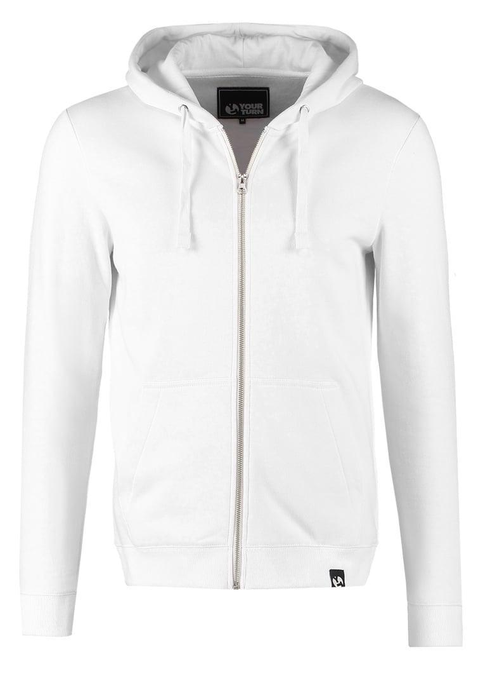
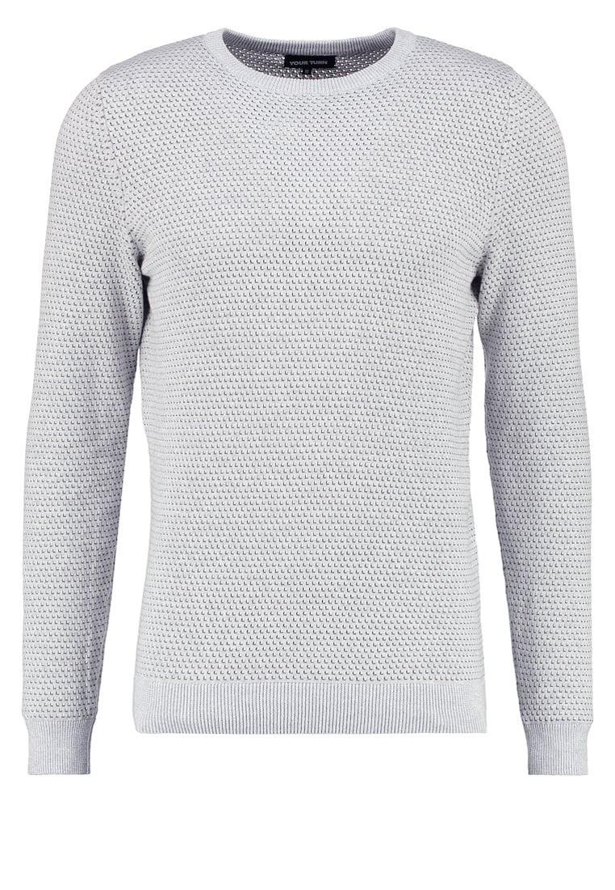

## Introduction

This program extracts a feature from a cloth image and then applies some manipulations. The output is the feature of the manipulated cloth image. After that, the image will be retrieved from the dataset.

### Example

We have the following image:

<p float="left" align="center">
  
</p>

If you want to remove the hood and the zip up from the image, you can ask to our model that will retrieve and image like this:

<p float="left" align="center">
  
</p>

### Our Contribution

This is a work based on amazon's [ADDE-M](https://github.com/amzn/fashion-attribute-disentanglement). The main difference is the support of multiple manipulations, because the original work only supports a single manipulation. 
The main advantage of our technique is data augmentation. In the amazon's method the query-target couples of training set are only with distance 1, but in our case the couples can be chosen from every image wich distance is < N

# Installation
1. Download [amazon's ADDE-M repo](https://github.com/amzn/fashion-attribute-disentanglement)
2. Clone our repo in the same folder
3. Install requirements with `pip install -r requirements.txt`

# Dataset
We used Shopping100k: [contact the author](https://sites.google.com/view/kenanemirak/home) of the dataset to get access to the images

After downloading that, you can create random couples using:

```
python3 f_dataset_gen.py
```

you can choose the maximum distance N of the couples inside the script

# Train
After created dataset (check section above), run:
```
python3 f_train.py
```

# Evaluation
You can evaluate model with:
```
python3 f_eval.py
```

